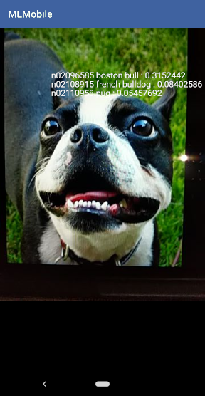

# IIvMobS-2-LR6

## 🤡 Искусственный интеллект в мобильных системах, Часть 2 (семестр 4)

### 8. Фреймворки Keras и OpenCV в мобильных приложениях с элементами искусственного интеллекта

----------

## ⚠️ Дисклеймер

> Руководство к практической работе (из ЛМС) находится в файле `ИИ в МобС-2_ 8.2. Руководство к практическому занятию 6_.pdf`
>
> Пример отчёта находится в файле `224-371_Fern_Lane_IIvMS2_PR6.odt` (формат OpenDocument). Открывается в большинстве офисных приложений. Если нужен иной формат (`.docx` / `pdf`), создайте Issue.

⚠️ **Не копируйте отчёт! Ваш отчёт должен отличаться и быть уникальным. Иначе забракуют и вашу, и мою лабу! Не используйте представленные в отчёте текстовые конструкции, и, тем более, изображения!**

> Все дальнейшие действия тестировались только на системе **Linux** и Python версии **3.7.17** (о Python читайте ниже)

----------

## 💩 Как это запустить?

1. Создайте какую-нибудь папку в которой будете делать эту практическую работу, чтобы все файлы были в одном месте
2. Установите Python версии **3.7**. На версиях выше работать не будет (проверено). Практическая работа была протестирована на Python версии **3.7.17**
   - Для дистрибутивов с менеджером пакетов Pamac:

    ```shell
    pamac install python37
    ```

   - Для Windows, скачать Python можно на официальном сайте: <https://www.python.org/downloads/>

3. Проверьте версию Python. Например: `python37 --version`. Либо можете напрямую использовать путь к исполняемому файлу
4. Создайте и запустите виртуальную среду (вместо `python37` используйте ту команду запуска Python **3.7**, которая сработала для вас)
    - На Linux

    ```shell
    python37 -m venv venv
    source venv/bin/activate
    ```

    - На Windows

    ```shell
    python37 -m venv venv
    venv\Scripts\activate.bat
    ```

5. Установите зависимости. Никаких ошибок в процессе возникнуть не должно

    ```shell
    pip install -r requirements.txt
    ```

6. Скачайте датасет изображений по прямой ссылке: <http://vision.stanford.edu/aditya86/ImageNetDogs/images.tar>
7. Распакуйте его таким образом, чтобы в распакованной папке (`Images`) были папки с изображениями. Ниже приведена структура распакованного архива

    ```text
    Images
    ├── n02085620-Chihuahua
    │   ├── n02085620_10074.jpg
    │   ├── n02085620_10131.jpg
    │   ...
    │   ├── n02085620_952.jpg
    │   └── n02085620_9654.jpg
    ├── n02085782-Japanese_spaniel
    │   ├── n02085782_1039.jpg
    │   ├── n02085782_1058.jpg
    │   ...
    ...
    ```

8. Создайте дополнительные папки

    ```shell
    mkdir tf_files
    mkdir tf_files/dogs_bottleneck_mobilenet
    mkdir model
    ```

9. Клонируйте ветку `v1.15.0` репозитория tensorflow/tensorflow

    ```shell
    git clone -b v1.15.0 --single-branch https://github.com/tensorflow/tensorflow.git
    ```

10. Клонируйте директорию examples из репозитория tensorflow/hub

    ```shell
    git clone -n --depth=1 --filter=tree:0 https://github.com/tensorflow/hub.git
    cd hub
    git sparse-checkout set --no-cone examples
    git checkout
    cd ..
    ```

11. Запустите обучение модели. При первом запуске будет долгая подготовка файлов с логами `... retrain.py:476] ... bottleneck files created.`. Оно должно создать столько же файлов сколько изображений в скаченном датасете (~20500)

    - На Linux

    ```shell
    python hub/examples/image_retraining/retrain.py \
      --output_graph=tf_files/dog_retrained_mobilenet10_224.pb \
      --output_labels=tf_files/dog_retrained_labels_mobilenet.txt \
      --image_dir Images \
      --bottleneck_dir=tf_files/dogs_bottleneck_mobilenet \
      --architecture mobilenet_1.0_224 --saved_model_dir model
    ```

    - На Windows

    ```shell
    python hub\examples\image_retraining\retrain.py --output_graph=tf_files\dog_retrained_mobilenet10_224.pb --output_labels=tf_files\dog_retrained_labels_mobilenet.txt --image_dir Images --bottleneck_dir=tf_files\dogs_bottleneck_mobilenet --architecture mobilenet_1.0_224 --saved_model_dir model
    ```

12. Обучение начётся когда в терминале будут такие логи. Дождитесь окончания обучения и сохранения модели

    ```text
    ... retrain.py:1109] ...: Step 0: Train accuracy = 22.0%
    ... retrain.py:1111] ...: Step 0: Cross entropy = 4.762917
    ... retrain.py:1130] ...: Step 0: Validation accuracy = 5.0% (N=100)

    ```

13. Убедитесь, что создались файлы:
    - `tf_files/dog_retrained_mobilenet10_224.pb`  
    - `tf_files/dog_retrained_labels_mobilenet.txt`
    - `model/saved_model.pb`

14. Покажите для отчёта что модель обучилась и корректно распознаёт изображения. Для этого, скачайте любое изображение собаки и выполните следующие команды
    - На Linux

    ```shell
    cd tensorflow
    python tensorflow/examples/label_image/label_image.py \
        --graph=../tf_files/dog_retrained_mobilenet10_224.pb \
        --image=../путь/к/изображению.png \
        --input_layer=Placeholder \
        --output_layer=final_result \
        --labels=../tf_files/dog_retrained_labels_mobilenet.txt \
        --input_height=299 \
        --input_width=299
    cd ..
    ```

    - На Windows

    ```text
    (╯°□°)╯︵ ┻━┻
    а фсьо, для шинды бобше не буит инструкциев
    ```

15. В результате распознавания должно быть что-то типа такого

    ```text
    n02085782 japanese spaniel 0.91382486
    n02086079 pekinese 0.044307142
    n02086240 shih tzu 0.0052610235
    n02086646 blenheim spaniel 0.0027033817
    n02086910 papillon 0.002611663
    ```

16. Для кучи красивых графиков, запустите TensorBoard. Но в начале, нужно снова запустить обучение (иначе папка с логами могла удалиться). Для этого, повторите пункт 11, но т.к. в задании требуется *С целью дальнейшего повышения точности модели проведите эксперименты...*, добавьте аргумент `--learning_rate 0.007` или любое другое значение. Модификаторы изображений из руководства лучше не использовать, т.к. они очень сильно снижают скорость обучения. Как только обучение началось, откройте второй терминал, перейдите в текущую папку со всеми файлами и активируйте виртуальную среду. Далее, запустите TensorBoard

    На Linux, `retrain.py` сохраняет логи в `/tmp/retrain_logs`, поэтому, чтобы запустить TensorBoard:

    ```shell
    tensorboard --logdir /tmp/retrain_logs
    ```

    На Windows папка с логами явно в другом месте. В ЛМС написано что это `tensorboard --logdir logs` но это наверняка не так. Попробуйте поискать папку `retrain_logs` в папке со временными файлами (`C:\Users\ИмяПользователя\AppData\Local\Temp`) или просто погуглите

17. Если папка с логами найдена верна, то когда начнётся обучение, на странице TensorBoard (в терминале должна была появится ссылка на страницу) появится граф и куча других графиков (смотрите вкладки **SCALARS** и **GRAPHS**). В процессе обучения делайте скриншоты и сохраняйте их для отчёта
18. Расскажите, что благодаря уменьшению / увеличению параметра скорости обучения модель обучилась лучше (даже если это не так)
19. Для пункта задания *Проведите оптимизацию модели одним из выбранных Вами способов (strip_unused или transform_graph)* запустите `strip_unused.py`, т.к. это единственное из двух, что не требует сборки. Ниже пример для Linux. Для шинды нужно как минимум поменять слэши :)

    ```shell
    cd tensorflow
    python tensorflow/python/tools/strip_unused.py \
    --input_graph=../tf_files/dog_retrained_mobilenet10_224.pb \
    --output_graph=../tf_files/stripped_dog_retrained_mobilenet10_224.pb \
    --input_node_names=Placeholder \
    --output_node_names=final_result \
    --input_binary=true
    cd ..
    ```

20. После оптимизации, должен появится файл `stripped_dog_retrained_mobilenet10_224.pb`. Продемонстрируйте то, что модель по прежнему работает (не обязательно), проделав пункт 14, только вместо `dog_retrained_mobilenet10_224.pb`, указав `stripped_dog_retrained_mobilenet10_224.pb`
21. 👓 Время конспирации! Для последнего задания с приложением, собрать и запустить реальный код скорее всего уже невозможно (хотя может у вас есть старая версия Android Studio и вы смогли найти нужный исходный код, но надо ли оно вам...). Поэтому, нужно в любом фото-редакторе сделать подобный скриншот:

    

22. В отчёте опишите что вы собирали приложение, меняли всякие переменные и запускали его на реальном устройстве / эмуляторами с сопутствующими конспирациями
23. Если хотите, можете даже что-нибудь вставить в качестве приложения в отчёт (рандомный код файла `MainActivity.java` приложения Android)

Удачи! 🍀
